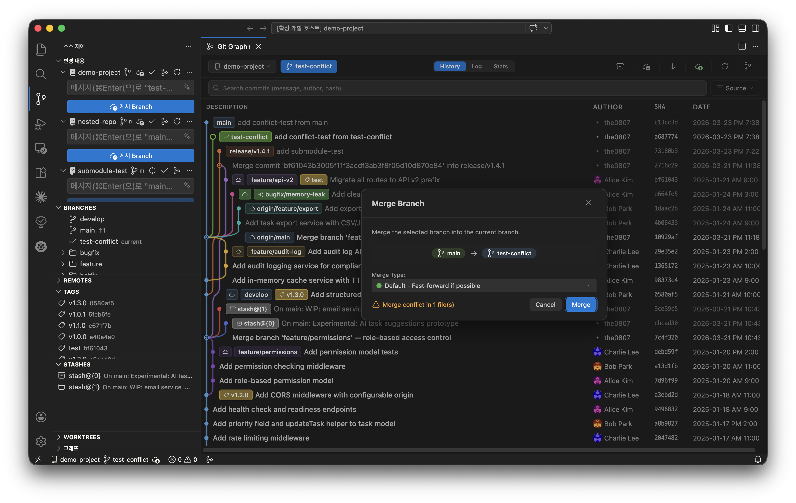
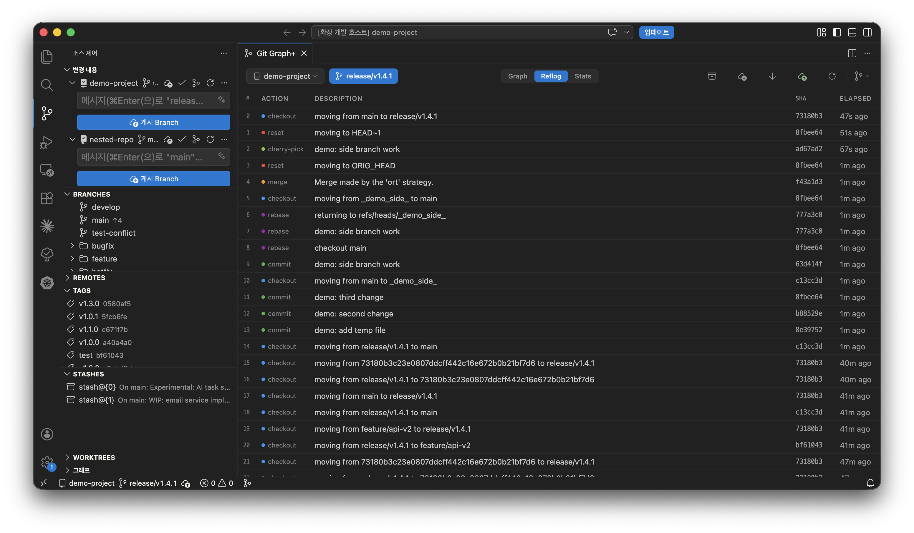

# Git Graph+

[English](README.md)

VS Code를 위한 모던 Git GUI. 커밋 히스토리를 시각화하고, 브랜치를 관리하고, 고급 Git 작업까지 에디터를 벗어나지 않고 수행할 수 있습니다.

> 스테이징, 커밋, 인라인 블레임은 VS Code 내장 소스 제어를 사용합니다. Git Graph+는 그 외 모든 것에 집중합니다.

---

## 주요 특징

- **인터랙티브 커밋 그래프** - 색상 구분 브랜치 레일과 머지 라인으로 히스토리를 한눈에
- **완전한 Git 워크플로우** - 브랜치, merge, rebase, cherry-pick, reset, stash, worktree, 태그, 리모트 작업
- **Interactive Rebase** - 드래그로 커밋 순서 변경, 커밋별 액션 제어 (pick, squash, fixup, drop 등)
- **내장 Diff 뷰어** - Shiki 기반 구문 강조, 이미지 diff (나란히 보기, 스와이프, 오니언 스킨)
- **충돌 해결** - 충돌 자동 감지, 인라인 배너, VS Code 3-way 병합 편집기 연동
- **고급 도구** - Git Flow, Bisect, LFS 파일 잠금, 서브모듈, 통계, Reflog

---

## 기능

### 커밋 그래프 & 히스토리

| 기능              | 설명                                                                                      |
| ----------------- | ----------------------------------------------------------------------------------------- |
| **그래프 시각화** | 색상 구분 브랜치 레일과 머지 라인이 포함된 인터랙티브 커밋 그래프                         |
| **커밋 정렬**     | Fork와 같은 위상순 정렬로 명확한 브랜치 히스토리 표시                                     |
| **세 가지 뷰**    | **그래프**로 시각적 히스토리, **Reflog**로 git 참조 로그 탐색, **통계**로 분석            |
| **커밋 상세**     | 커밋 클릭으로 메타데이터, 변경 파일, 전체 diff를 크기 조절 가능한 하단 패널에서 확인      |
| **커밋 비교**     | 기준 커밋 선택 후 다른 커밋 클릭으로 비교 - 또는 커밋과 작업 트리 비교                    |
| **검색**          | 메시지, 작성자, 날짜 범위, 해시, 변경된 파일로 커밋 검색 - 결과 하이라이트 및 키보드 탐색 |
| **Push 상태**     | 로컬 전용 커밋은 파란 점 (push 안 됨), 리모트 전용 커밋은 회색 점 (리모트가 앞서감)       |
| **아바타**        | 작성자명 옆에 Gravatar 아바타 표시                                                        |
| **테마**          | 라이트, 다크, 고대비 VS Code 테마 완벽 지원                                               |

### 브랜치 & 태그 관리

  
  

| 기능                     | 설명                                                                                    |
| ------------------------ | --------------------------------------------------------------------------------------- |
| **브랜치 작업**          | 브랜치 생성, 이름 변경, 삭제, checkout                                                  |
| **Merge**                | Default, `--no-ff`, `--ff-only`, squash merge 전략                                      |
| **Rebase**               | 일반 rebase 및 드래그로 순서 변경 가능한 interactive rebase UI                          |
| **Interactive Rebase**   | 액션 드롭다운 (pick, reword, edit, squash, fixup, drop) 및 drop 경고가 포함된 시각적 UI |
| **Cherry-pick & Revert** | 특정 커밋 적용 또는 되돌리기, `--no-commit` 옵션 포함                                   |
| **Reset**                | soft, mixed, hard 모드로 임의의 커밋으로 reset                                          |
| **태그**                 | 경량 또는 주석 태그 생성; 태그 상세 보기, 리모트에 push, 로컬/리모트 삭제               |
| **Upstream 추적**        | upstream 설정 기반 로컬/리모트 브랜치 자동 매칭                                         |

### 리모트 작업

| 기능                    | 설명                                                                     |
| ----------------------- | ------------------------------------------------------------------------ |
| **Fetch / Pull / Push** | 리모트 선택 다이얼로그 및 진행 상태 알림                                 |
| **리모트 관리**         | 리모트 추가 및 제거                                                      |
| **강제 Push**           | `--force-with-lease` (안전) 또는 `--force` (강제) 모드, 시각적 경고 표시 |
| **자동 Fetch**          | 설정 가능한 주기적 fetch 간격 (1–60분)                                   |
| **리모트 Checkout**     | 로컬 트래킹 브랜치 생성 다이얼로그와 함께 리모트 브랜치 checkout         |
| **Pull 제안**           | 리모트보다 뒤처진 브랜치 checkout 시 자동 pull 제안                      |

### 충돌 해결

  
  

| 기능                 | 설명                                                  |
| -------------------- | ----------------------------------------------------- |
| **자동 감지**        | Merge, rebase, cherry-pick, revert 시 충돌 자동 감지  |
| **충돌 배너**        | 파일별 상태 표시와 함께 충돌 파일 목록 표시           |
| **에디터 연동**      | 충돌 파일 클릭으로 VS Code 3-way 병합 편집기에서 열기 |
| **해결 & 스테이징**  | 파일별 "해결 완료 표시" 및 자동 스테이징              |
| **Continue / Abort** | 원클릭으로 작업 계속 또는 중단                        |

### Diff 뷰어

| 기능               | 설명                                                                              |
| ------------------ | --------------------------------------------------------------------------------- |
| **파일 트리**      | 상태 배지가 있는 계층적 파일 브라우저 (Added, Modified, Deleted, Renamed, Copied) |
| **구문 강조**      | Shiki 기반 - 에디터 수준의 정확한 구문 색상                                       |
| **이미지 Diff**    | 이미지 변경사항에 대한 나란히 보기 및 스와이프 비교                               |
| **Patch 내보내기** | 임의의 커밋을 `.patch` 파일로 저장                                                |

### Stash & Worktree

| 기능                | 설명                                                                      |
| ------------------- | ------------------------------------------------------------------------- |
| **Stash**           | 저장, 적용, pop, 삭제, 이름 변경 - untracked 파일 및 keep-index 옵션 포함 |
| **그래프 내 Stash** | 커밋 그래프에 stash 항목이 배지로 표시되며 전용 컨텍스트 메뉴 제공        |
| **Worktree**        | 목록, 추가, 제거, 정리 및 연결된 브랜치 정리                              |

### 고급 도구

  
  

| 기능           | 설명                                                                              |
| -------------- | --------------------------------------------------------------------------------- |
| **Git Flow**   | Feature, release, hotfix 브랜치 초기화 및 관리                                    |
| **Git Bisect** | 시각적 bisect UI - 시작, good/bad 표시, reset                                     |
| **Git LFS**    | LFS 추적 파일 목록 확인 및 파일 잠금 관리                                         |
| **서브모듈**   | 상태 확인, 업데이트, 서브모듈 리포지토리로 그래프 전환                            |
| **통계**       | 작성자별 커밋 통계 (Gravatar 포함), 활동 히트맵                                   |
| **Reflog**     | git 참조 로그 전체 탐색 — 과거 HEAD 상태에서 reset, checkout, cherry-pick 가능    |

### 멀티 리포지토리 & 서브모듈

- 워크스페이스 내 서브모듈 자동 탐색
- 툴바 드롭다운으로 리포지토리 전환

### 액티비티 바 사이드바

- **Branches**, **Remotes**, **Tags**, **Stashes**, **Worktrees** 트리 뷰
- 클릭으로 빠른 액션 메뉴, 우클릭으로 전체 컨텍스트 메뉴
- 브랜치 정렬: `main`/`master` 우선, 이후 알파벳순

### 다국어 지원

- 영어 (기본), 한국어, 중국어 간체
- `gitGraphPlus.locale` 설정으로 변경 가능
- Git 용어 (commit, merge, rebase, push, pull, fetch 등)는 번역하지 않음

---

## 시작하기

1. [VS Code Marketplace](https://marketplace.visualstudio.com/items?itemName=the0807.git-graph-plus)에서 설치
2. Git 리포지토리가 포함된 폴더 열기
3. Git Graph+ 열기:
   - **명령 팔레트** - `Git Graph+: Open`
   - **액티비티 바** - Git Graph+ 아이콘 클릭
   - **SCM 제목 표시줄** 또는 **상태 표시줄** - git-merge 아이콘 클릭

---

## 설정

| 설정                             | 기본값        | 설명                                                  |
| -------------------------------- | ------------- | ----------------------------------------------------- |
| `gitGraphPlus.autoRefresh`       | `true`        | 리포지토리 변경 감지 시 자동 새로고침                 |
| `gitGraphPlus.autoFetch`         | `true`        | 리모트에서 주기적으로 자동 fetch                      |
| `gitGraphPlus.autoFetchInterval` | `10`          | 자동 fetch 간격 (분, 1–60)                            |
| `gitGraphPlus.graphSortOrder`    | `topological` | 커밋 정렬 순서 (`topological`, `date`, `author-date`) |
| `gitGraphPlus.locale`            | `auto`        | UI 언어 (`auto`, `en`, `ko`, `zh-cn`)                 |

---

## 요구 사항

- VS Code 1.85.0 이상
- Git이 설치되어 있고 PATH에서 사용 가능

## 크레딧

- [Git Graph](https://github.com/mhutchie/vscode-git-graph), [Fork](https://git-fork.com/), [SourceGit](https://github.com/sourcegit-scm/sourcegit)의 UI/UX에서 아이디어를 얻었습니다
- 이 프로젝트는 [Git Graph](https://github.com/mhutchie/vscode-git-graph)의 코드를 사용하지 않으며, 모든 코드는 처음부터 새로 작성되었습니다
- 확장 아이콘: [VS Code Codicons](https://github.com/microsoft/vscode-codicons), [CC BY 4.0](https://creativecommons.org/licenses/by/4.0/) 라이선스

## 변경 이력

[CHANGELOG.md](CHANGELOG.md)에서 릴리스 히스토리를 확인할 수 있습니다.

## 라이선스

[Apache-2.0](LICENSE)
