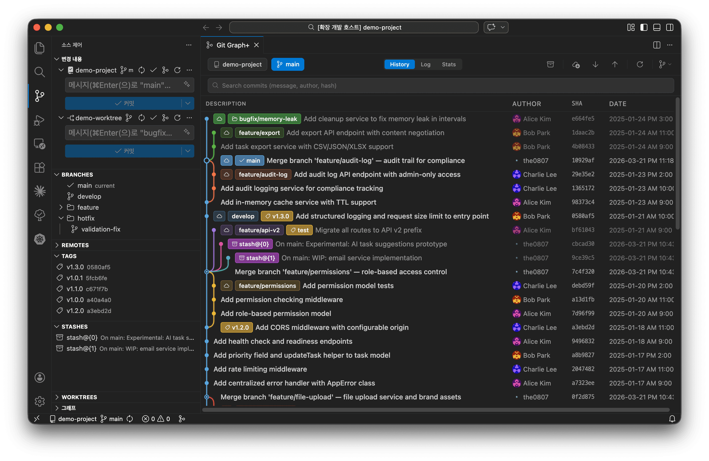
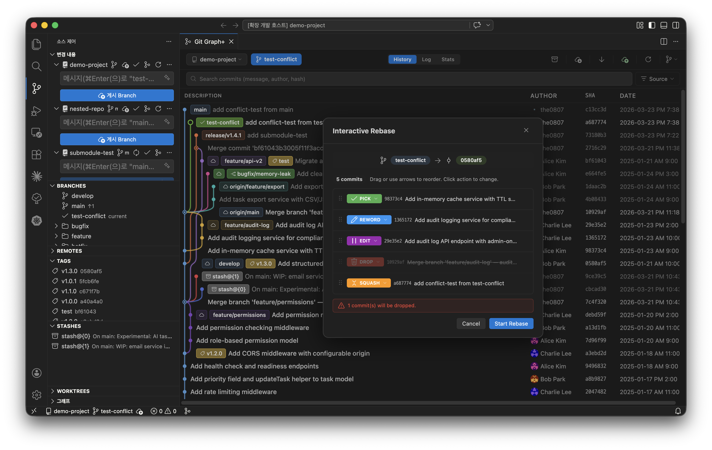
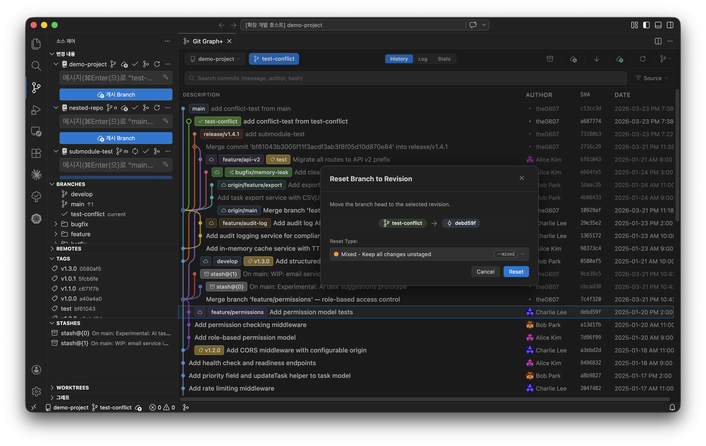
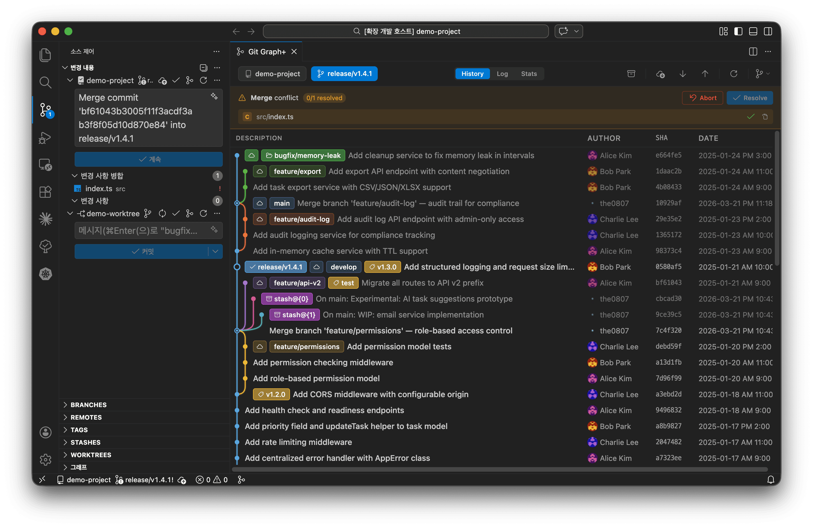
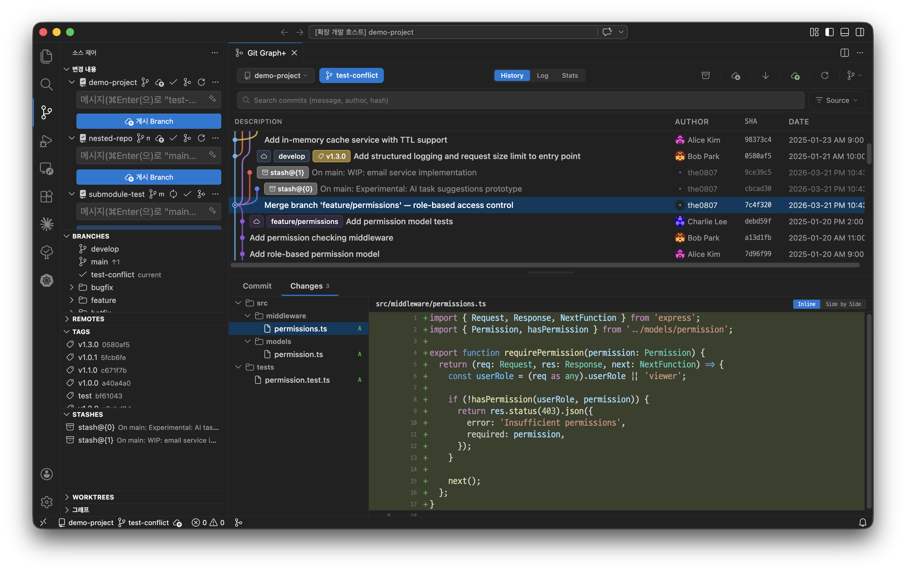
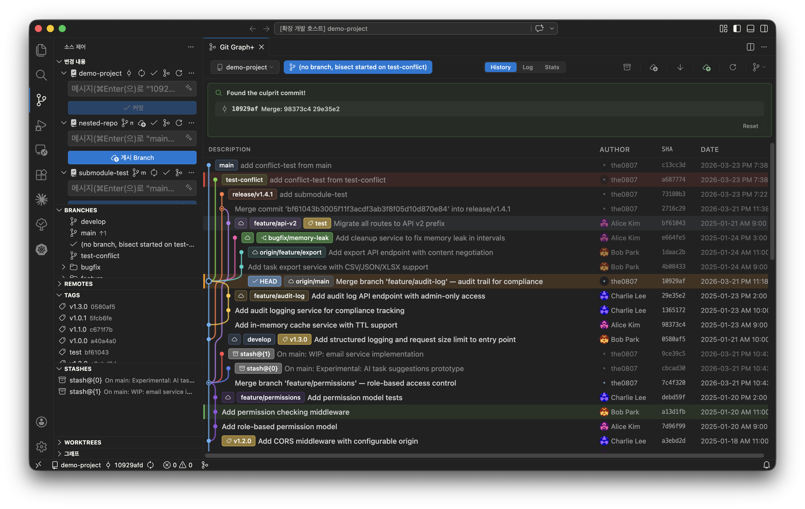
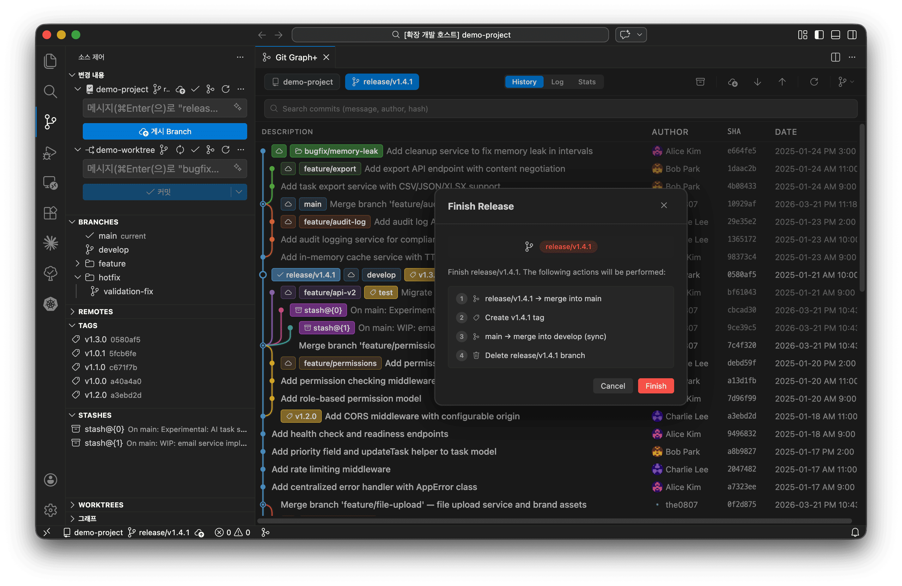

# Git Graph+

[한국어](README.ko.md)

A modern, full-featured Git GUI for VS Code. Visualize your commit history, manage branches, and perform advanced git operations — all without leaving your editor.

> Staging, committing, and inline blame use VS Code's built-in Source Control. Git Graph+ focuses on everything else.

---

## Highlights

- **Interactive Commit Graph** — Color-coded branch rails and merge lines for clear history at a glance
- **Full Git Workflow** — Branch, merge, rebase, cherry-pick, reset, stash, worktree, tags, and remote operations
- **Interactive Rebase** — Drag-to-reorder commits with per-commit action control (pick, squash, fixup, drop, etc.)
- **Built-in Diff Viewer** — Shiki-powered syntax highlighting with image diff (side-by-side, swipe, onion-skin)
- **Conflict Resolution** — Auto-detects conflicts with inline banner and VS Code 3-way merge editor integration
- **Advanced Tools** — Git Flow, Bisect, LFS with file locks, Submodules, Statistics, and Activity Log

---

## Features

### Commit Graph & History

| Feature                 | Description                                                                                                           |
| ----------------------- | --------------------------------------------------------------------------------------------------------------------- |
| **Graph Visualization** | Interactive commit graph with color-coded branch rails and merge lines                                                |
| **Commit Ordering**     | Topological ordering like Fork for clear branch history                                                               |
| **Three Views**         | **Graph** for visual history, **Log** for compact list, **Statistics** for analytics                                  |
| **Commit Details**      | Click any commit to view metadata, changed files, and full diffs in a resizable bottom panel                          |
| **Commit Comparison**   | Select a base commit, then click another to compare — or compare any commit to your working tree                      |
| **Search**              | Find commits by message, author, date range, hash, or changed file — with result highlighting and keyboard navigation |
| **Push Status**         | Blue dot for local-only commits (not pushed), gray dot for remote-only commits (remote ahead)                         |
| **Avatars**             | Gravatar avatars displayed next to author names                                                                       |
| **Themes**              | Full support for light, dark, and high-contrast VS Code themes                                                        |

### Branch & Tag Management

  
  

| Feature                  | Description                                                                                |
| ------------------------ | ------------------------------------------------------------------------------------------ |
| **Branch Operations**    | Create, rename, delete, and checkout branches                                              |
| **Merge**                | Default, `--no-ff`, `--ff-only`, and squash merge strategies                               |
| **Rebase**               | Standard rebase and interactive rebase with drag-to-reorder UI                             |
| **Interactive Rebase**   | Visual UI with action dropdown (pick, reword, edit, squash, fixup, drop) and drop warnings |
| **Cherry-pick & Revert** | Apply or undo specific commits, with `--no-commit` option                                  |
| **Reset**                | Reset to any commit with soft, mixed, or hard mode                                         |
| **Tags**                 | Create lightweight or annotated tags; push, delete locally, or delete from remote          |
| **Upstream Tracking**    | Automatic local/remote branch matching based on upstream configuration                     |

### Remote Operations

| Feature                 | Description                                                                    |
| ----------------------- | ------------------------------------------------------------------------------ |
| **Fetch / Pull / Push** | With remote selection dialog and progress notification                         |
| **Remote Management**   | Add and remove remotes                                                         |
| **Force Push**          | Uses `--force-with-lease` for safety, with visual warning indicator            |
| **Auto Fetch**          | Configurable periodic fetch interval (1–60 minutes)                            |
| **Remote Checkout**     | Checkout remote branches with local tracking branch creation dialog            |
| **Pull Prompt**         | Automatic pull suggestion when checking out a branch that is behind its remote |

### Conflict Resolution

| Feature                | Description                                                     |
| ---------------------- | --------------------------------------------------------------- |
| **Auto Detection**     | Detects conflicts during merge, rebase, cherry-pick, and revert |
| **Conflict Banner**    | Shows conflicting files with per-file status indicators         |
| **Editor Integration** | Click conflict files to open in VS Code's 3-way merge editor    |
| **Resolve & Stage**    | Per-file "Mark as Resolved" with automatic staging              |
| **Continue / Abort**   | One-click buttons to continue or abort the operation            |

### Diff Viewer

| Feature                 | Description                                                                              |
| ----------------------- | ---------------------------------------------------------------------------------------- |
| **File Tree**           | Hierarchical file browser with status badges (Added, Modified, Deleted, Renamed, Copied) |
| **Syntax Highlighting** | Powered by Shiki — accurate, editor-quality syntax colors                                |
| **Image Diff**          | Side-by-side visual preview with swipe comparison for image changes                      |
| **Patch Export**        | Save any commit as a `.patch` file                                                       |

### Stash & Worktree

| Feature            | Description                                                                    |
| ------------------ | ------------------------------------------------------------------------------ |
| **Stash**          | Save, apply, pop, and drop — with untracked files and keep-index options       |
| **Stash in Graph** | Stash entries appear as badges in the commit graph with dedicated context menu |
| **Worktree**       | List, add, remove, and prune worktrees with linked branch cleanup              |

### Advanced Tools

  
  

| Feature          | Description                                                          |
| ---------------- | -------------------------------------------------------------------- |
| **Git Flow**     | Initialize and manage feature, release, and hotfix branches          |
| **Git Bisect**   | Visual bisect UI — start, mark good/bad, and reset                   |
| **Git LFS**      | View LFS-tracked files and manage file locks                         |
| **Submodules**   | View status, update submodules, and switch graph to submodule repos  |
| **Statistics**   | Commits by author (with Gravatar), activity heatmap                  |
| **Activity Log** | Filterable log of all Git operations performed through the extension |

### Multi-Repository & Submodules

- Auto-discovers submodules within the workspace
- Switch between repositories via the toolbar dropdown

### Activity Bar Sidebar

- Tree views for **Branches**, **Remotes**, **Tags**, **Stashes**, and **Worktrees**
- Click to open quick action menu, right-click for full context menu
- Branches sorted: `main`/`master` first, then alphabetical

### Internationalization

- English (default) and Korean
- Configurable via `gitGraphPlus.locale` setting
- Git terms (commit, merge, rebase, push, pull, fetch, etc.) remain untranslated

---

## Getting Started

1. Install from the [VS Code Marketplace](https://marketplace.visualstudio.com/items?itemName=the0807.git-graph-plus)
2. Open a folder containing a Git repository
3. Open Git Graph+ using any of:
   - **Command Palette** — `Git Graph+: Open`
   - **Activity Bar** — Click the Git Graph+ icon
   - **SCM title bar** or **Status bar** — Click the git-merge icon

---

## Settings

| Setting                          | Default | Description                         |
| -------------------------------- | ------- | ----------------------------------- |
| `gitGraphPlus.maxCommits`        | `1000`  | Maximum commits to load initially   |
| `gitGraphPlus.autoRefresh`       | `true`  | Auto-refresh on repository changes  |
| `gitGraphPlus.autoFetch`         | `true`  | Periodically fetch from remotes     |
| `gitGraphPlus.autoFetchInterval` | `10`    | Auto-fetch interval (minutes, 1–60) |
| `gitGraphPlus.locale`            | `auto`  | UI language (`auto`, `en`, `ko`)    |

---

## Requirements

- VS Code 1.85.0 or later
- Git installed and available in PATH

## Acknowledgements

- UI/UX ideas from [Git Graph](https://github.com/mhutchie/vscode-git-graph), [Fork](https://git-fork.com/), and [SourceGit](https://github.com/sourcegit-scm/sourcegit)
- This project does not use any code from [Git Graph](https://github.com/mhutchie/vscode-git-graph). All code has been written from scratch.
- Extension icon from [VS Code Codicons](https://github.com/microsoft/vscode-codicons), licensed under [CC BY 4.0](https://creativecommons.org/licenses/by/4.0/)

## Changelog

See [CHANGELOG.md](CHANGELOG.md) for release history.

## License

[Apache-2.0](LICENSE)
