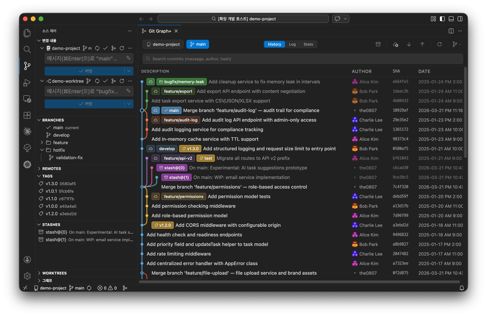
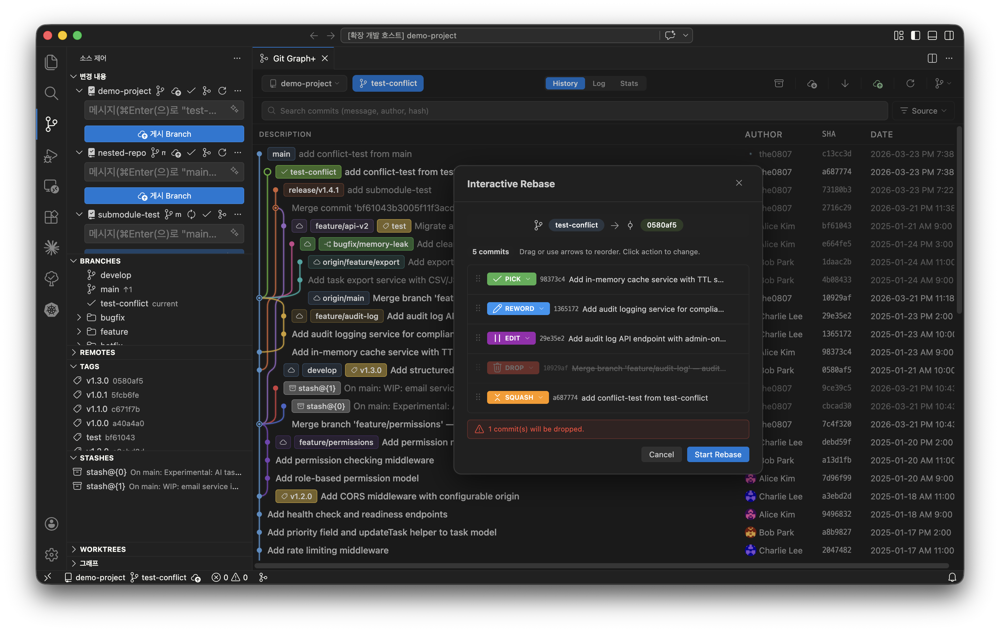
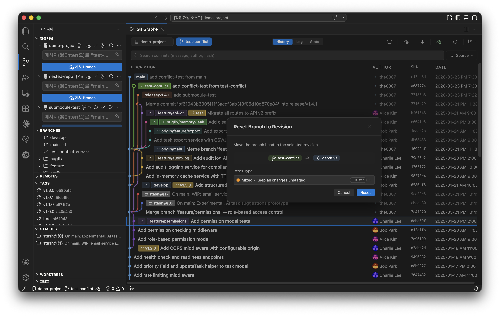
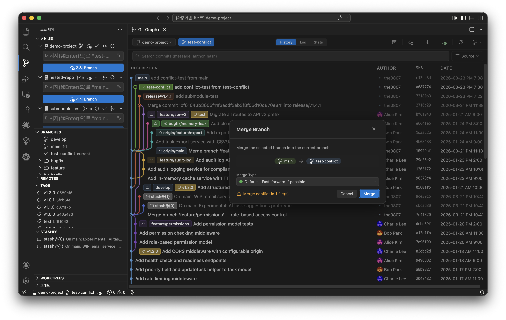
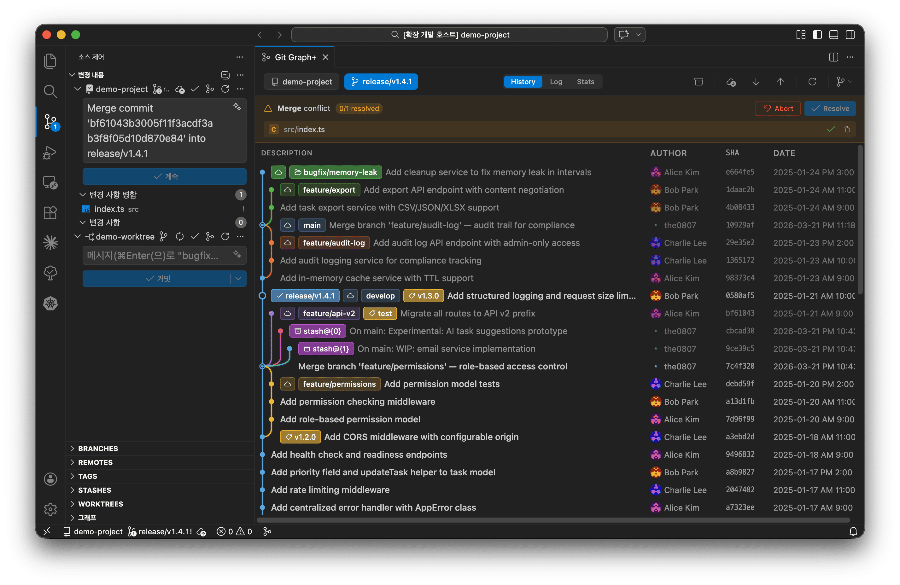
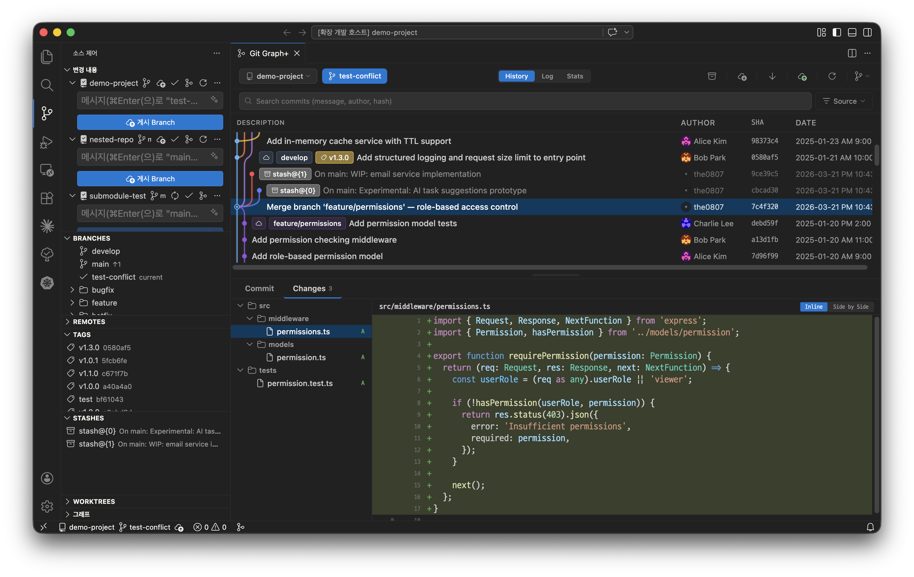
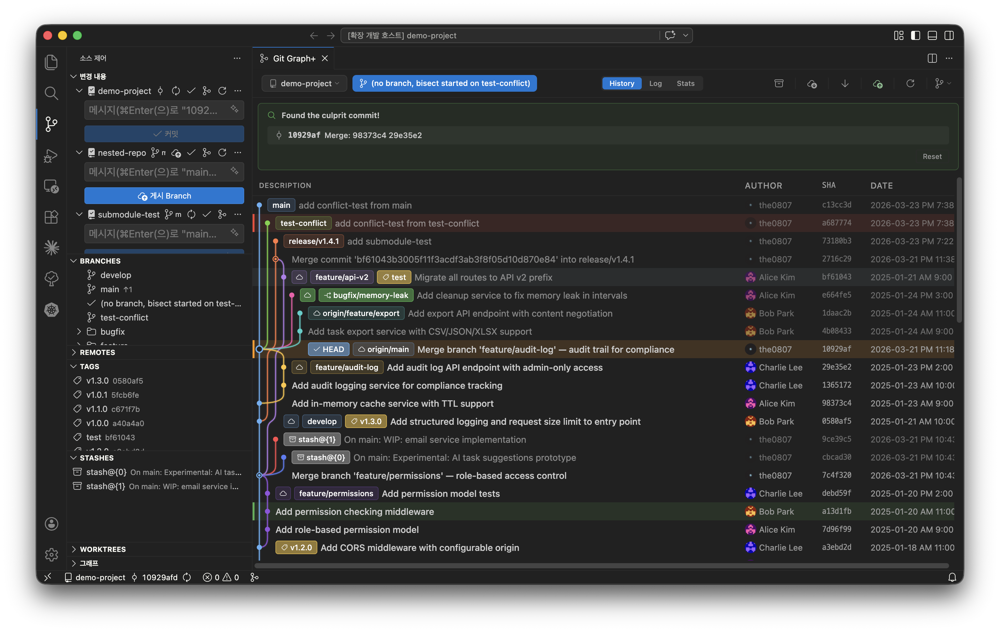
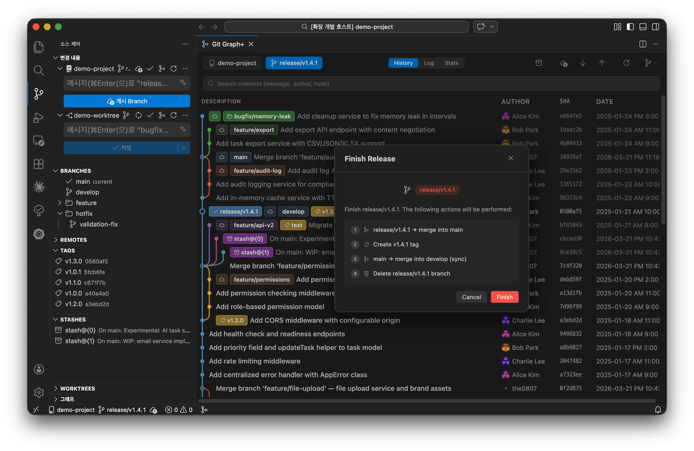
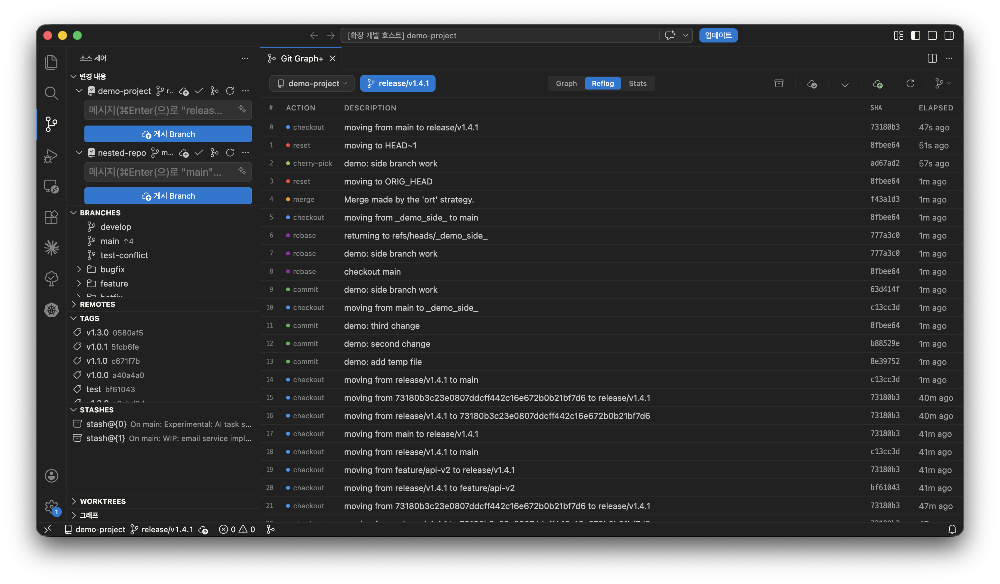

# Git Graph+

[한국어](README.ko.md)

A modern, full-featured Git GUI for VS Code. Visualize your commit history, manage branches, and perform advanced git operations - all without leaving your editor.

> Staging, committing, and inline blame use VS Code's built-in Source Control. Git Graph+ focuses on everything else.

---

## Highlights

- **Interactive Commit Graph** - Color-coded branch rails and merge lines for clear history at a glance
- **Full Git Workflow** - Branch, merge, rebase, cherry-pick, reset, stash, worktree, tags, and remote operations
- **Drag to Rebase & Merge** - Drag one branch onto another to rebase or merge it - no commands needed
- **Interactive Rebase** - Drag-to-reorder commits with per-commit action control (pick, squash, fixup, drop, etc.)
- **Fixup & Squash Workflow** - Create `fixup!`/`squash!` commits from the graph, then fold them in with the interactive-rebase autosquash toggle
- **Conflict Prediction & Resolution** - Preview conflicting files before you run a merge/rebase, then resolve in the VS Code 3-way merge editor
- **Built-in Diff Viewer** - Shiki-powered syntax highlighting with image diff (side-by-side, swipe, onion-skin)
- **Markdown Commit Messages** - Commit descriptions render as formatted Markdown in the details panel, with a Markdown/Plain toggle
- **Advanced Git Tooling** - Git Flow, Bisect, LFS with file locks, Submodules, Statistics, and Reflog with dangling-commit recovery

---

## Features

### Commit Graph & History

| Feature                 | Description                                                                                                           |
| ----------------------- | --------------------------------------------------------------------------------------------------------------------- |
| **Graph Visualization** | Interactive commit graph with color-coded branch rails and merge lines                                                |
| **Commit Ordering**     | Topological ordering like Fork for clear branch history                                                               |
| **Three Views**         | **Graph** for visual history, **Reflog** for git reference log history, **Statistics** for analytics                  |
| **Commit Details**      | Click any commit to view metadata, changed files, and full diffs in a resizable bottom panel                          |
| **Markdown Messages**   | Commit messages containing Markdown render formatted in the details panel, with a Markdown/Plain toggle               |
| **Commit Links**        | Issue, PR, and merge-request references in commit messages become clickable links - GitHub/GitLab auto-detected from `origin`, plus custom regex rules |
| **Commit Comparison**   | Select a base commit, then click another to compare - select multiple commits to toggle a combined changes panel, or compare any commit to your working tree |
| **Search**              | Find commits by message, author, date range, hash, or changed file - with result highlighting and keyboard navigation |
| **Jump to HEAD**        | A button beside the search box scrolls to the current HEAD commit (emphasized when off-screen); search also matches the `HEAD` keyword |
| **Keyboard Navigation** | Move the graph selection with arrow keys; Ctrl/Cmd jumps to the first parent or newest child, remembering the path back |
| **Branch Filter**       | Filter the commit graph to show only commits reachable from a selected branch                                         |
| **Uncommitted Changes** | Shows pending uncommitted changes as a virtual node. Clicking it opens the VS Code SCM view for staging/committing. |
| **Push Status**         | Blue dot for local-only commits (not pushed), gray dot for remote-only commits (remote ahead)                         |
| **Avatars**             | Gravatar avatars displayed next to author names                                                                       |
| **Themes**              | Full support for light, dark, and high-contrast VS Code themes                                                        |

### Branch & Tag Management

  
  

| Feature                  | Description                                                                                           |
| ------------------------ | ----------------------------------------------------------------------------------------------------- |
| **Branch Operations**    | Create, rename, delete, and checkout branches                                                         |
| **Branch Toolbar**       | Fork-style split button: create a branch (or worktree) seeded from the current branch, with **Lean Sync** (rebase the current branch onto the default branch), **Lean Finish** (merge it into the default branch), and a nested Git Flow menu |
| **Amend**                | Amend the last commit directly from the graph with a single click                                    |
| **Merge**                | Default, `--no-ff`, `--ff-only`, and squash merge strategies                                          |
| **Rebase**               | Standard rebase and interactive rebase with drag-to-reorder UI                                        |
| **Interactive Rebase**   | Keyboard-driven visual UI with action dropdown (pick, reword, edit, squash, fixup, drop), drop warnings, and an autosquash toggle that folds `fixup!`/`squash!` commits into their targets - start it from a branch or a multi-commit selection. An optional classic mode runs `git rebase -i` in an integrated terminal (`gitGraphPlus.interactiveRebase.mode`) |
| **Drag to Rebase/Merge** | Drag one branch onto another in the graph to rebase it onto, or merge it into, the target             |
| **Squash Commits**       | Select multiple consecutive commits in the graph and squash them into one                             |
| **Fixup / Squash Commit** | Commit staged changes as a `fixup!` or `squash!` of any commit straight from its context menu, ready for autosquash |
| **Cherry-pick & Revert** | Apply or undo specific commits (one or several selected at once), with `--no-commit` option           |
| **Reset**                | Reset to any commit with soft, mixed, or hard mode                                                    |
| **Tags**                 | Create lightweight or annotated tags; view tag details, push to remote, delete locally or from remote |
| **Upstream Tracking**    | Automatic local/remote branch matching based on upstream configuration                                |

### Remote Operations

| Feature                 | Description                                                                    |
| ----------------------- | ------------------------------------------------------------------------------ |
| **Fetch / Pull / Push** | With remote selection dialog and progress notification - fetch skips the dialog when only one remote exists |
| **Remote Management**   | Add and remove remotes                                                         |
| **Force Push**          | `--force-with-lease` (safe) or `--force` (override) modes, with visual warning |
| **Auto Fetch**          | Configurable periodic fetch interval (1–60 minutes)                            |
| **Remote Checkout**     | Checkout remote branches with local tracking branch creation dialog            |
| **Pull Prompt**         | Automatic pull suggestion when checking out a branch that is behind its remote |

### Conflict Resolution

  
  

| Feature                | Description                                                     |
| ---------------------- | --------------------------------------------------------------- |
| **Conflict Prediction** | Merge and rebase modals preview which files would conflict, listed on hover before you run the operation |
| **Auto Detection**     | Detects conflicts during merge, rebase, cherry-pick, and revert |
| **Conflict Banner**    | Shows conflicting files with per-file status indicators         |
| **Editor Integration** | Click conflict files to open in VS Code's 3-way merge editor    |
| **Resolve & Stage**    | Per-file "Mark as Resolved" with automatic staging              |
| **Continue / Abort**   | One-click buttons to continue or abort the operation            |

### Diff Viewer

| Feature                 | Description                                                                              |
| ----------------------- | ---------------------------------------------------------------------------------------- |
| **File Tree**           | Hierarchical file browser with status badges (Added, Modified, Deleted, Renamed, Copied) |
| **Syntax Highlighting** | Powered by Shiki - accurate, editor-quality syntax colors                                |
| **Image Diff**          | Side-by-side visual preview with swipe comparison for image changes                      |
| **Patch Export**        | Save any commit as a `.patch` file                                                       |
| **Open in Editor**      | Right-click any file in the diff viewer to open it or view its changes in VS Code        |
| **File Path Actions**   | Right-click a file to reveal it in the OS file explorer, copy its absolute path, or copy its repo-relative path |
| **Reverse Changes**     | Undo a whole file, a single hunk, or gutter-selected lines of a commit against your working tree — and copy selected lines — right from the diff |

### Stash & Worktree

| Feature            | Description                                                                      |
| ------------------ | -------------------------------------------------------------------------------- |
| **Stash**          | Save, apply, pop, drop, and rename - with untracked files and keep-index options |
| **Stash in Graph** | Stash entries appear as badges in the commit graph with dedicated context menu   |
| **Worktree**       | List, add, remove, and prune worktrees, create one straight from the commit graph context menu, open them in a new window or reveal in the file explorer, with linked branch cleanup |

### Advanced Tools

  
  

| Feature        | Description                                                                                                                                                                                  |
| -------------- | -------------------------------------------------------------------------------------------------------------------------------------------------------------------------------------------- |
| **Git Flow**   | Initialize and manage feature, release, and hotfix branches                                                                                                                                  |
| **Git Bisect** | Visual bisect UI - start, mark good/bad, and reset                                                                                                                                           |
| **Git LFS**    | View LFS-tracked files and manage file locks                                                                                                                                                 |
| **Submodules** | View status, update submodules, and switch graph to submodule repos                                                                                                                          |
| **Statistics** | Commits by author (with Gravatar), activity heatmap                                                                                                                                          |
| **Reflog**     | Browse the full git reference log with semantic color-coded sub-actions (amend, squash, etc.), search, action filters, and per-branch view. Includes dangling commit detection and recovery. |

### Multi-Repository & Submodules

- Auto-discovers submodules within the workspace
- Switch between repositories via the toolbar dropdown

### Activity Bar Sidebar

- Tree views for **Branches**, **Remotes**, **Tags**, **Stashes**, and **Worktrees**
- Click to open quick action menu, right-click for full context menu
- Branches sorted: `main`/`master` first, then alphabetical

### Internationalization

- English (default), Korean, and Chinese Simplified
- Configurable via `gitGraphPlus.locale` setting
- Git terms (commit, merge, rebase, push, pull, fetch, etc.) remain untranslated

---

## Getting Started

1. Install from the [VS Code Marketplace](https://marketplace.visualstudio.com/items?itemName=the0807.git-graph-plus)
2. Open a folder containing a Git repository
3. Open Git Graph+ using any of:
   - **Command Palette** - `Git Graph+: Open`
   - **Activity Bar** - Click the Git Graph+ icon
   - **SCM title bar**, **Status bar**, or **Editor title bar** - Click the git-merge icon

> [!Tip]
> For the best experience, enable these VS Code settings:
> - `git.autofetch: true` - keeps the graph up to date by periodically fetching from all remotes
> - `git.fetchPrune: true` - removes stale remote-tracking branches on each fetch

---

## Settings

| Setting                                | Default       | Description                                              |
| -------------------------------------- | ------------- | -------------------------------------------------------- |
| `gitGraphPlus.autoRefresh`             | `true`        | Auto-refresh on repository changes                       |
| `gitGraphPlus.timeout`                 | `60`          | Max time (seconds) to wait for a Git command before abort |
| `gitGraphPlus.initialCommitCount`      | `200`         | Commits loaded on first render / refresh (lower = faster in huge repos) |
| `gitGraphPlus.loadMoreCommitCount`     | `50`          | Extra commits fetched per **Load more commits** click    |
| `gitGraphPlus.locale`                  | `auto`        | UI language (`auto`, `en`, `ko`, `zh-cn`)                |
| `gitGraphPlus.graphSortOrder`          | `topological` | Commit sort order (`topological`, `date`, `author-date`) |
| `gitGraphPlus.avatarSource`            | `gravatar`    | Author avatar source (`gravatar` online/cache, `retro` fully offline) |
| `gitGraphPlus.interactiveRebase.mode`  | `ui`          | Interactive rebase mode (`ui` visual editor, `classic` `git rebase -i` in a terminal) |
| `gitGraphPlus.showSignatureStatus`     | `true`        | Show GPG/SSH signature status in the graph               |
| `gitGraphPlus.commitMessageLinks`      | `[]`          | Custom `{ pattern, url }` regex rules that turn commit-message text into clickable links |
| `gitGraphPlus.autoDetectRepoLinks`     | `true`        | Auto-link `#123` issues (github.com/gitlab.com) and `!123` GitLab MRs from the `origin` remote |
| `gitGraphPlus.branchBadgeBarThickness` | `thin`        | Branch badge bar thickness (`thin`, `medium`, `thick`)   |
| `gitGraphPlus.branchColors`            | `[]`          | Fixed branch colors by name pattern (regex → hex)        |
| `gitGraphPlus.graphColors`             | 12 colors     | Color palette auto-assigned to graph rails (hex strings) |

### Operation Defaults

Preset the default options for each operation dialog under `gitGraphPlus.defaults.*` (configure in VS Code Settings):

| Operation       | Options (under `gitGraphPlus.defaults.`)                                                     |
| --------------- | -------------------------------------------------------------------------------------------- |
| Push            | `push.force`, `push.setUpstream`, `push.allTags`                                             |
| Pull            | `pull.rebase`, `pull.stash`                                                                  |
| Fetch           | `fetch.allRemotes`                                                                           |
| Merge           | `merge.mode`, `merge.pushAfter`, `merge.deleteSource`                                        |
| Rebase          | `rebase.autostash`, `rebase.pushAfter`                                                       |
| Amend           | `amend.keepMessage`, `amend.resetDate`, `amend.resetAuthor`, `amend.only`, `amend.pushAfter` |
| Checkout        | `checkout.dirty`, `checkoutRemote.dirty`                                                     |
| Create Branch   | `createBranch.checkout`, `createBranch.publish`                                              |
| Create Tag      | `createTag.push`                                                                             |
| Cherry-pick     | `cherryPick.noCommit`, `cherryPick.pushAfter`                                                |
| Revert          | `revert.noCommit`, `revert.pushAfter`                                                        |
| Reset           | `reset.mode`                                                                                 |
| Stash           | `stashSave.includeUntracked`, `stashSave.keepIndex`                                          |
| Delete Branch   | `deleteBranch.force`, `deleteBranch.deleteRemote`                                            |
| Delete Tag      | `deleteTag.deleteRemote`                                                                     |
| Remove Worktree | `removeWorktree.deleteBranch`                                                                |

---

## Requirements

- VS Code 1.85.0 or later
- Git installed and available in PATH (or configured via the `git.path` setting)

## Acknowledgements

- UI/UX ideas from [Git Graph](https://github.com/mhutchie/vscode-git-graph), [Fork](https://git-fork.com/), and [SourceGit](https://github.com/sourcegit-scm/sourcegit)
- This project does not use any code from [Git Graph](https://github.com/mhutchie/vscode-git-graph). All code has been written from scratch.
- Extension icon from [VS Code Codicons](https://github.com/microsoft/vscode-codicons), licensed under [CC BY 4.0](https://creativecommons.org/licenses/by/4.0/)

## Changelog

See [CHANGELOG.md](CHANGELOG.md) for release history.

## License

[Apache-2.0](LICENSE)
